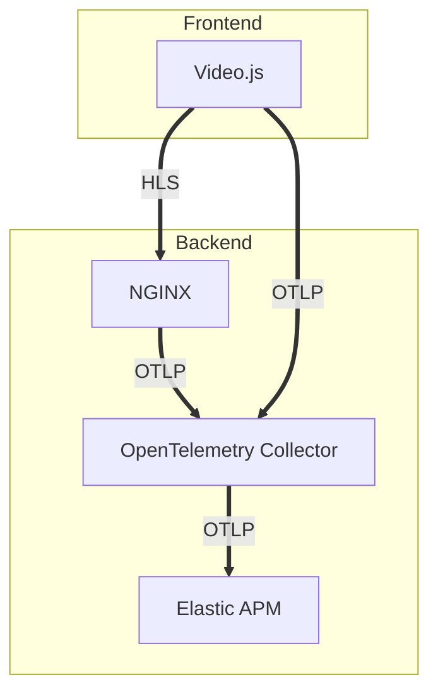
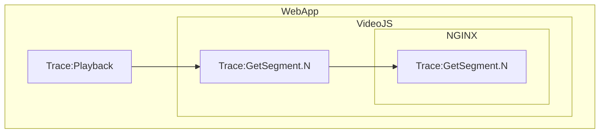
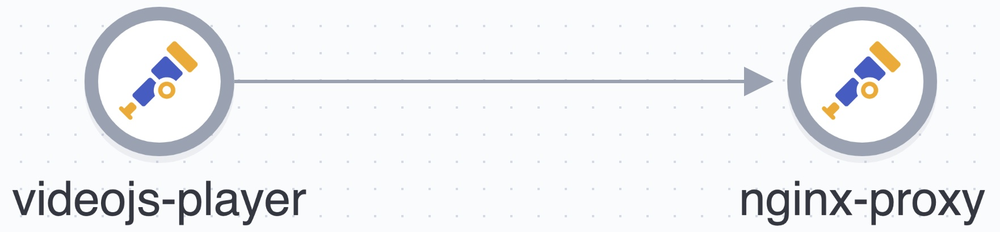
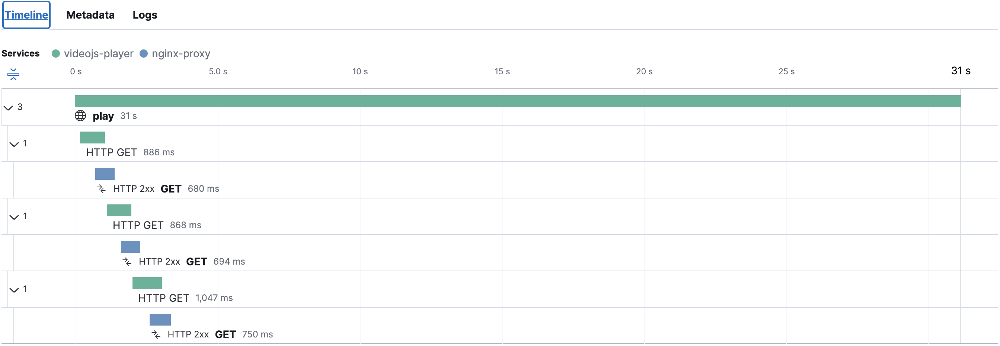
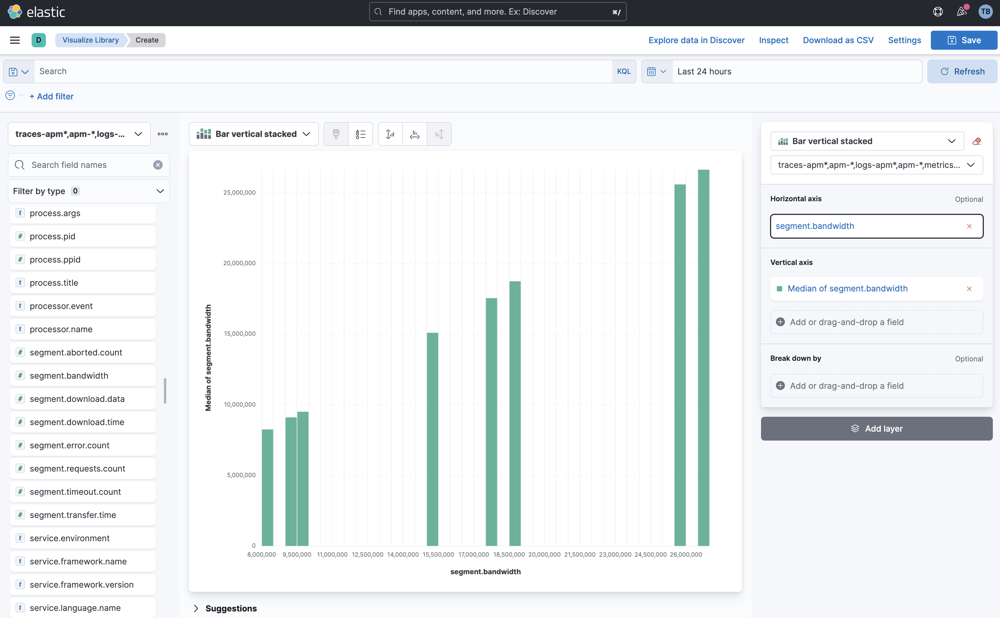
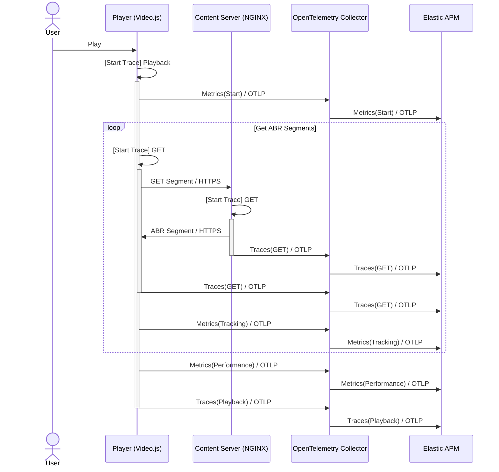

# Video.js OpenTelemetry + Elastic Observability Demo

<p align="center">
<a href="https://elastic.co/"></a>&nbsp
<a href="https://opentelemetry.io/"></a>&nbsp
<a href="https://videojs.com/"></a>&nbsp
<a href="https://www.nginx.com/"></a>&nbsp
</p>

---

This is an exemplary project intended to showcase how:
* [OpenTelemetry](https://opentelemetry.io) can be used to instrument existing front-end libraries or applications with metrics and tracing
* OpenTelemetry can be used to instrument distributed tracing and metrics across front-end requests and back-end services
* Tracing, conceptually, can be used (abused?) in video players to observe end-to-end adaptive bitrate behavior (e.g., segment fetch) over the lifecycle of playback
* OpenTelemetry can be practically used with front-end JavaScript, back-end NGINX, and [Elasticsearch APM](https://www.elastic.co/observability/application-performance-monitoring) to instrument a real-world use case of moderate complexity
* Use of a unified Tracing and Metrics observability solution (Elasticsearch APM) enables a wealth of rich visualization, machine learning, and alerting tools for observing user video playback



# Getting Started

## Prerequisites

1. [Install Docker](https://docs.docker.com/get-docker/)
2. [Setup a (free) Elastic Cloud trial](https://cloud.elastic.co/) or, if you prefer, [download our docker images](https://www.elastic.co/guide/en/elasticsearch/reference/current/docker.html) to run an Elastic cluster locally
3. Clone this repository

## Configuration & Build

1. Setup Elastic APM Integration
    1. [Launch Kibana on your new deployment](https://cloud.elastic.co/home)
    2. Navigate to `/app/apm` on your Kibana instance
    3. Click `Add data` 
    4. Copy `serverUrl` from `APM Agents` > `Node.js` > `Configure the agent`
    5. Copy `secretToken` from `APM Agents` > `Node.js` > `Configure the agent`
    6. Create a `apm.env` file in the root of this repository with your APM `serverUrl` and `secretToken`
        ```
        ELASTIC_APM_SERVER_URL="(serverUrl)"
        ELASTIC_APM_SECRET_TOKEN="(secretToken)"
        ```
3. `docker compose build` in the root of this repository

## Running
1. `docker compose up` in the root of this repository

## Validation

1. Start video playback by navigating to [http://127.0.0.1:8090/](http://127.0.0.1:8090/)
2. [Launch Kibana on your Elastic stack](https://cloud.elastic.co/home)
3. Navigate to `/app/discover` on your Kibana instance
4. Ensure `traces-apm*,...` is selected as your data view
5. Ensure new trace and metric records are being received from both the front-end player as well as the nginx back-end

# Motivation

Given the dynamic nature of [OpenTelemetry](https://opentelemetry.io)'s path to a 1.0 release, I struggled to find working and practical examples of using OpenTelemetry for distributed tracing and metrics. The latter proved particularly challenging: what (working) metric examples existed tended to assume greenfield application development and were trivial in nature.

As a former digital video engineer, I was always frustrated by the lack of good open-source solutions for capturing ABR playback metrics and behaviors. While good/great proprietary options exist, I wanted a solution I could easily plug into a metrics backend of my choosing, one that I could customize with additional metadata, and one that I could integrate with tracing and other sources of observability.

With the recent availability of [native OpenTelemetry support in Elastic's APM](https://www.elastic.co/guide/en/apm/guide/current/open-telemetry.html), [NGINX's OpenTelemetry module](https://github.com/open-telemetry/opentelemetry-cpp-contrib/tree/main/instrumentation/nginx), and [OpenTelemetry for Javascript](https://github.com/open-telemetry/opentelemetry-js), I wanted to see how far I could get toward building an open observability solution for Video.js video playback.

As an aside, I also am a big proponent of relegating the ubiquitous "log file" (arguably back) to a debugging role rather than carrying production metrics. Logging is a fragile and inefficient way to record data. Given the historical lack of good cross-language, cross-platform, open-standards for transporting metrics and events, logging has generally carried the torch for production metrics. Fortunately, with the advent of OpenTelemetry, we are starting to see industry adoption of formal, standardized mechanisms to convey observability (see [NGINX's support for OpenTelemetry](https://www.nginx.com/blog/integrating-opentelemetry-modern-apps-reference-architecture-progress-report/)).

Finally, I found myself wondering if it would make sense to model a user's video playback session as an overarching parent span with individual ABR segment retrievals as linked child spans (I have not seen this done elsewhere). Modeling a playback session as an overall Trace provides a nice means of associating all of the subsequent HTTPS GETs (both from a front-end and a back-end perspective) with a user's overall playback session. Moreover, it allows you to avail yourself of the rich feature set offered by a distributed APM tracing solution (e.g., tail-based sampling, events, correlation with metrics, correlation between front-end and back-end requests) without resorting to bespoke means of association.

As illustrated below, a parent span is created for the overall playback session. Each XHR request within Video.js VHS for an ABR segment becomes a child of that overarching playback span. Each of those Video.js segment request spans in turn creates a corresponding child span within NGINX.



# Observation

## Tracing / Service Map

1. Start video playback by navigating to [http://127.0.0.1:8090/](http://127.0.0.1:8090/)
2. [Launch Kibana on your Elastic stack](https://cloud.elastic.co/home)
3. Navigate to `/app/apm` on your Kibana instance
4. Select `APM` > `Service Map` to see the linkage between the front-end (videojs-player) and the backend (nginx-proxy)



In our trivial example, the services mapped out as expected. You can imagine chaining other operations onto the NGINX back-end side of the ABR segment fetch (e.g., authorization) which could also be traced and linked to APM.

## Tracing / Traces

1. Start video playback by navigating to [http://127.0.0.1:8090/](http://127.0.0.1:8090/)
2. [Launch Kibana on your Elastic stack](https://cloud.elastic.co/home)
3. Navigate to `/app/apm` on your Kibana instance
4. Select `APM` > `Traces` > `play` to see the linkage between the front-end (videojs-player) and the backend (nginx-proxy)



Our sample video is truncated to 30s, comprised of 3 ~10s segments. Note that we can easily visualize the timing of the individual Video.js ABR segment fetch operations (`HTTP GET`) as part of the overall `play` trace. Note further than we further chain the NGINX proxy operation for each segment as a child of each Video.js ABR segment fetch operation. Immediately we can see that (as expected), the vast majority of the latency in delivering ABR segments to the front-end is a function of our proxy operation.

## Tracing / Maps

If you can put your back-end on the public Internet for testing, `client.ip` in your traces will be populated with a valid public IP, which in turn can be reverse geocoded.

1. Start video playback by navigating to [http://127.0.0.1:8090/](http://127.0.0.1:8090/)
2. [Launch Kibana on your Elastic stack](https://cloud.elastic.co/home)
3. Navigate to `/app/maps` on your Kibana instance
4. Select `Add layer`
5. Select `Documents`
6. Set `Data view` to `traces-apm*,...`
7. Set `client.get.location` as the `Geospatial field`

## Metrics

Elastic makes it easy to build out rich visualizations and dashboards custom designed for your market and application. All of the metrics we are capturing (including metrics inherently created by tracing) can be easily visualized in Kibana using Lens.

As an example, say we wanted a histogram of the bandwidth (in bits/sec) clients were achieving as they downloaded ABR segments. To graph this, we can do the following:

1. [Launch Kibana on your Elastic stack](https://cloud.elastic.co/home)
2. Navigate to `/app/visualize` on your Kibana instance
3. Select `Create new visualization`
4. Select `Lens`
5. Click the calendar icon in the upper-right and select a larger time frame (e.g., `Last 24 hours`)
6. Find `segment.bandwidth` in the list of fields on the left
7. Drag `segment.bandwidth` to the `Horizontal Axis` 
8. Drag `segment.bandwidth` to the `Vertical Axis`

The resulting graph should look something like the following:



# Engineering Notes

## Data Flow




## videojs-event-tracking

I used [videojs-event-tracking](https://github.com/spodlecki/videojs-event-tracking) as an "out of box" means of obtaining periodic playback events and statistics from [Video.js](https://videojs.com). This presented an interesting challenge: this plugin pushes statistics (a combination of counters and gauges) to a callback at the 25%, 50%, 75%, and 100% playout positions. The [OpenTelemetry Metrics API](https://opentelemetry.io/docs/reference/specification/metrics/api/) only supports Observable (async) Gauges. An Observable (async) gauge is generally used to instantaneously sample a data point (rather than to push a data point on-demand). This poses a problem, however, if you are interfacing against an existing library that itself pushes out metrics and events on specific, periodic intervals. To work around this interface conflict, I use a global variable to store the latest set of pushed metrics from videojs-event-tracking, which I then subsequently (ideally immediately) observe using OpenTelemetry. That presented the next challenge: the OpenTelemetry Metrics SDK comes with a PeriodicExportingMetricReader designed to observe a Gauge on regular, periodic intervals. In my case, however, I wanted to command OpenTelemetry to immediately observe a gauge, and further, to not observe that gauge again until videojs-event-tracking pushed a new set of values. To that end, I forked the existing [PeriodicExportingMetricReader](https://github.com/open-telemetry/opentelemetry-js/blob/main/experimental/packages/opentelemetry-sdk-metrics-base/src/export/PeriodicExportingMetricReader.ts) to create a new [OneShotExportingMetricReader](https://github.com/ty-elastic/videojs_observability/blob/main/src/OneShotExportingMetricReader.js) which, as the name implies, can be commanded (via a `forceFlush`) to immediately observe a set of counters and gauges exactly once per flush. Is there a better way to do this? Obviously, we could write our own Video.js plugin better suited for asynchronous observation. If there exists a better way to observe existing gauges which are 'pushed' to an application with OpenTelemetry, I'm all ears!

## instrumentation-xml-http-request

I also needed to coax Video.js into emitting OpenTelemetry Tracing during ABR segment fetches. I was able to use [instrumentation-xml-http-request](https://github.com/open-telemetry/opentelemetry-js/tree/main/experimental/packages/opentelemetry-instrumentation-xml-http-request) to auto-instrument these requests, though I immediately ran into an issue: you need to set the [Context](https://opentelemetry.io/docs/instrumentation/js/api/context/) for Tracing such that OpenTelemetry knows if a given request is a new parent span, or if it is a nested child span (e.g., part of my overall playback span). This presents a challenge since the Video.js ABR segment fetch happens asynchronously deep within the Video.js library. Since I knew instrumentation-xml-http-request already hooks XHR requests, I decided to hook `_createspan` within instrumentation-xml-http-request such that I could set the appropriate context before a span is created.

*src/index.js:*
```
xhrInstrumentation.__createspan = xhrInstrumentation._createspan;
xhrInstrumentation._createspan = (xhr, url, method) => {
  if (playerspan) {
    context.with(trace.setspan(context.active(), playerspan), () => {
      xhrInstrumentation.__createspan(xhr, url, method);
    });
  } else {
    xhrInstrumentation.__createspan(xhr, url, method);
  }
}
```

## Attribute Propagation

Finally, I wanted to propagate a few attributes across the distributed tracing between the front-end and the back-end. Ideally, this is accomplished using [Baggage](https://opentelemetry.io/docs/instrumentation/js/api/context/). At present, however, it appears the [NGINX OpenTelemetry module](https://github.com/open-telemetry/opentelemetry-cpp-contrib/tree/main/instrumentation/nginx) does not yet support Baggage. As a workaround, I used the `player.tech().vhs.xhr.beforeRequest` hook available within [Video.js VHS](https://github.com/videojs/http-streaming#vhsxhr) to explicitly add several contextual headers to each ABR segment fetch which I could in turn retrieve and set as OpenTelemetry attributes from within NGINX:

*src/index.js:*
```
player.tech().vhs.xhr.beforeRequest = function (options) {
    options.headers["x-playback-instance-id"] = INSTANCE_ID;
    options.headers["x-playback-source-url"] = player.currentSrc();
    return options;
  };
```

*nginx/nginx.conf:*
```
opentelemetry_attribute "player.instance.id" $http_x_playback_instance_id;
opentelemetry_attribute "player.source.url" $http_x_playback_source_url;
```

# Next Steps

Here are some ideas on ways to further improve this exemplary demonstration:

* Author a Video.js plugin that instruments more of the player functionality with a better asynchronous observability model
* Use Elastic Machine Learning to detect anomalies in the captured metrics
* Build out a dashboard of KPIs in Kibana
* Instrument and integrate tracing and metrics from additional back-end microservices that comprise video playback sessions (e.g., authorization)

# FAQ

### ***No traces are emitted on ABR segment fetch***

If the HLS playlist or segments are already cached locally in your browser, they will not be retrieved by Video.js VHS. Ideally, this too would be reported as a span (with a distinguishing status code), but instrumenting this would require changes to Video.js VHS.

Additionally, if your browser doesn't support [MSE](https://en.wikipedia.org/wiki/Media_Source_Extensions) but rather uses native HLS playback (e.g., iOS on iPhones), I suspect (but have not confirmed) [instrumentation-xml-http-request](https://github.com/open-telemetry/opentelemetry-js/tree/main/experimental/packages/opentelemetry-instrumentation-xml-http-request) will not be triggered.

### ***Can I output traces and metrics to other OpenTelemetry systems beyond Elastic?***

Yes! This is part of the magic of OpenTelemetry. You can easily duplicate or redirect traces and metrics from the OpenTelemetry Collector to any supported backend via its [configuration file](https://github.com/ty-elastic/videojs_observability/blob/main/collector/config.yaml).

### ***Why are you using the contributer build of the OpenTelemetry collector?***

Data to Elastic APM is most easily secured using APM Secret Tokens carried in a gRPC header (along with the OTLP payload). Support for [Bearer Tokens](https://github.com/open-telemetry/opentelemetry-collector-contrib/tree/main/extension/bearertokenauthextension) is only available (today) in the contributor build.

### ***Does this scale? Can I run this in production?***

This demo is, of course, a toy meant to showcase the art of the possible using bleeding edge observability tools. As such, it would require considerable testing and tweaking to be appropriate for production use cases.

### ***Can OpenTelemetry Agents send traces and metrics directly to Elastic APM without using an OpenTelemetry Collector?***

Yes, this should be possible, though it is complicated by authentication. You obviously don't want to embed a bearer token in a web-based front-end application. Elastic APM does support anonymous agents (for [RUM](https://www.elastic.co/guide/en/apm/guide/current/apm-rum.html)), though I'm not certain that will work with off-the-shelf OpenTelemetry OTLP/HTTP agents. Additionally, I don't believe the current version of the [NGINX OpenTelemetry module](https://github.com/open-telemetry/opentelemetry-cpp-contrib/tree/main/instrumentation/nginx) supports bearer token authentication.

# LICENSE

Apache License 2.0

Fork this, make it real, and build something awesome! If it's OSS, a credit/link back to this repository would be appreciated!
